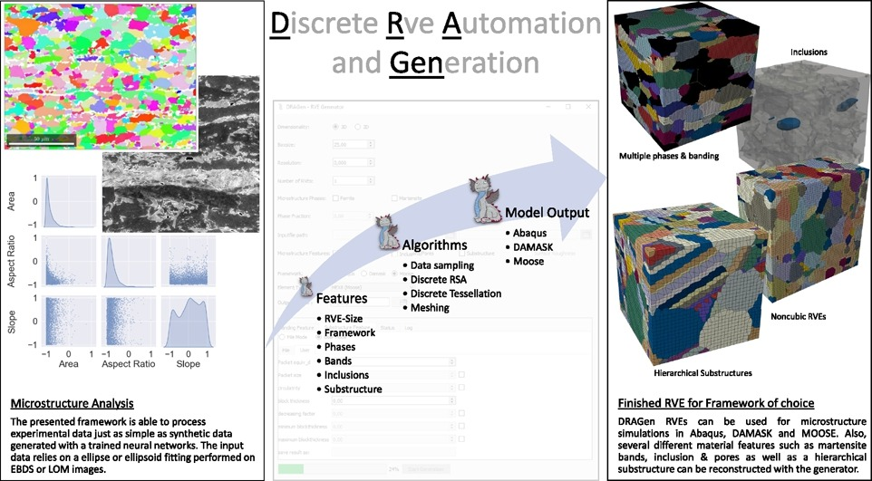
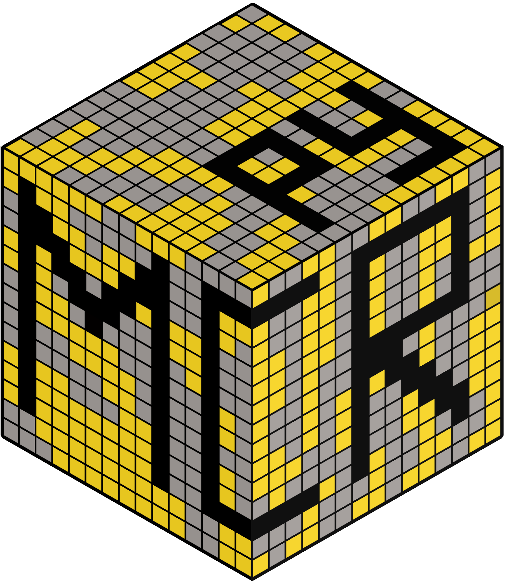
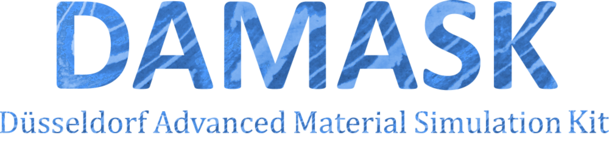

<h1> GA-Calibration Tool </h1>

<!--## Overview-->
<!---->

 [**Installation**](#Installation)
| [**Related Projects**](#Related-Projects)
| [**Tutorial**](Tutorial)


**Genetic Algorithm Calibration Tool** is a Python-based software developed to streamline the calibration of material constitutive models using genetic algorithms. This tool supports calibration with experimental data such as **uniaxial tensile test** and **cyclic loading test** results, offering a powerful solution for researchers and engineers in material science.
### Key Features:
- **Experimental Data Calibration**: Calibrate constitutive models using experimental results from **uniaxial tensile** and **cyclic loading** tests.
- **Supported Material Models**: Includes support for **Crystal Plasticity Models** and the **Chaboche Model** for material behavior simulation.
- **Numerical Integration**: Works with **ABAQUS** and **DAMASK**, enabling users to integrate the tool with these widely-used numerical frameworks.
- **Submodel Calibration in ABAQUS**: Offers calibration within ABAQUS **submodels**, allowing users to focus on localized regions of their models for precise analysis.
- **Single-phase and Dual-phase Materials**: Capable of calibrating both **single-phase** and **dual-phase** materials, broadening its application scope.
- **Concurrent Job Submission**: Supports **concurrent job submission** to efficiently utilize **High-Performance Computing (HPC) clusters**, significantly accelerating the calibration process.
- **Genetic Algorithm Optimization**: Uses genetic algorithms to perform parameter optimization, ensuring a robust search of the parameter space for improved accuracy and performance.

This tool is tailored for users looking to match their experimental results with material models in order to predict material behavior more accurately, providing an efficient and flexible solution for **crystal plasticity** and **constitutive modeling**.
Do not change the directory names because the tool relies on the structure!
<p align="left"> </img></p>

_Note: For developing it is highly recommended to use Python versions Python 3.10._<br>
**If further questions appear please check the lower section or get in touch with us.**


## Installation

As the first step, conda needs to be installed.
To be sure conda is installed correctly on your system [look up here](https://docs.conda.io/projects/conda/en/latest/user-guide/install/index.html)<br>

Git must be installed on the system. Check with:
```
$ git --version
```
If it has not been installed use this:
```
$ conda install -c anaconda git
```
Open the user path and create the directory where the DRAGen repo will be cloned.
Should be like this:
```
(base) C:\Users> cd \Users\{username}
(base) C:\Users\username> mkdir GitRepos
(base) C:\Users\username> cd GitRepos
```
To clone this repository into the desired destination, use:<br>
```
$ git clone https://github.com/ibf-RWTH/DRAGen.git
```
To be able to use DRAGen, the working directory must be set to the location where the repo was downloaded to in the previous step file which is downloaded at the previous step.
Use the commands to go to the exact file by following the path.
```
$ cd DRAGen
```
To see the folders on the current point:
```
$ dir
```
Create a virtual environment as follows:<br>
```
$ conda create --name DRAGen python=3.10
$ conda activate DRAGen
```
(if an error occurs check your conda installation)<br>
To see the list of the environments on conda:
```
$ conda info --envs
```
Be sure the DRAGen environment is activated it should look somewhat like this:<br>
```
(DRAGen)....$
```
Install one of two required module packages depending on cuda availability on the device:

To install requirements without cuda:<br>
```
(DRAGen)....$ pip install -r requirements.txt
```
To install requirements if cuda is available:<br>
```
(DRAGen)....$ pip install -r requirements_cuda.txt
```
Check if every step is utilized correctly by running first generation with:<br>
```
(DRAGen)....$ python DRAGen_nogui.py
```
Run DRAGen:<br>
```
(DRAGen)....$ python DRAGen.py
```

## Related Projects

### MCRpy
<p align="center"> </img></p>

[MCRpy](https://github.com/NEFM-TUDresden/MCRpy) (Microstructure Characterization and Reconstruction in Python) facilitates the process by employing a range of descriptors and enables the reconstruction of new microstructures. One key advantage of MCRpy is its extensibility, allowing the combination of various descriptors without the need for loss functions. Additionally, it provides flexibility in choosing optimizers to address emerging optimization problems.


### DAMASK
<p align="center"> </img></p>

[DAMASK](https://damask.mpie.de/index.html) (Düsseldorf Advanced Materials Simulation Kit) excels in its ability to handle a variety of simulation programs under different conditions, particularly for advanced high-strength materials. Its capability to address the interconnected nature of deformation, phase transformations, heating effects, and potential damage makes DAMASK an invaluable choice for researchers and practitioners seeking a comprehensive understanding of materials behavior in diverse scenarios.


### Moose

<p align="center"> </img></p>

[MOOSE](https://mooseframework.inl.gov/) (Multiphysics Object-Oriented Simulation Environment) framework is an open-source software framework designed for solving complex physics-based engineering simulations. Moose supports adaptive mesh refinement which improves the accuracy and efficiency. It is possible to develop a simulation application tailored to specific needs.


### MTEX

<p align="center"> </img></p>

[MTEX](https://mtex-toolbox.github.io/index) (Materials Texture and Microstructure Analysis Toolbox) is an open-source Matlab tool that allows data processing using techniques such as EDSB, and analysis on microstructure and crystallographic textures. It has powerful visualization tools for displaying crystallographic data, including pole figures, stereographic projections, and other graphical representations of orientation information.


